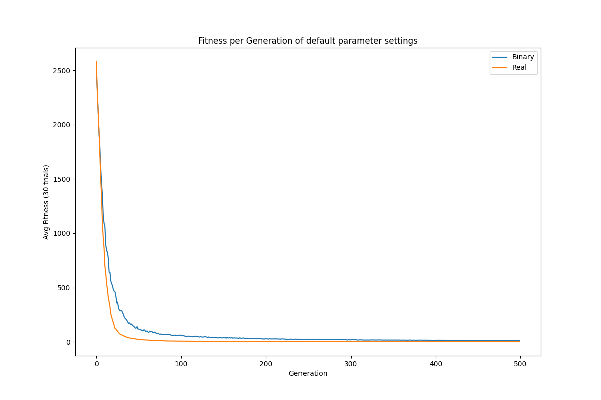

# EC_hw1_SCH

This project implements binary GA and real-valued GA in C++17 with different operators to find the minimal solution of the Schwefel function (SCH):

$$ f_{SCH}(\vec{x}) = 418.98291N − \sum_{i=1}^{N} x_{i}\sin(\sqrt{| x_i |} ), \quad -512 \leq x_{i} \leq 511 \quad and \quad N=10$$ 

<p align="center">

</p>

## Prerequisites
- C++ compiler that supports C++17
- Python 3.x with Matplotlib and Pandas installed
    ```
    pip install pandas matplotlib
    ```
## Run this Project
To run the program, use the following command:
```bash
make run ARGS="arg1 arg2"
# or
make
./main arg1 arg2
```
where arg1 and arg2 are optional command-line arguments.

| General Argument          | Description                                                                                                   |
| ------------------------- | ------------------------------------------------------------------------------------------------------------- |
| `--algorithm`             | Set the algorithm to use. Only binary, only real or both (default: both)                                      |
| `--detail`                | Set the number of printing detail or not (default: 0)                                                         |
| `--cross_prob`            | Set the crossover probability (default: 0.9)                                                                  |
| `--mut_prob`              | Set the mutation probability (default: 0.1)                                                                   |
| `--n_point`               | Set the number of crossover points (only for binary GA, and need to set uniform to 0) (default: 2)            |
| `--p_select`              | Set the number of tournament selection when parent selection period (default: 2)                              |
| `--p_size`                | Set the population size (default: 100)                                                                        |
| `--term`                  | Set the termination criterion (default: 500)                                                                  |
| `--trial`                 | Set the number of trials (default: 30)                                                                        |
| `--uniform`               | Use uniform crossover (1) or 2-point for binary GA, whole arithmetic for real-valued GA (0) (default: 1)      |

If the --help option is set, the program will print the usage information and exit.
```bash
make run ARGS="--help"
# or
./main --help
```
#### Get Result 
To directly get the result of the compilation, run, plot directly, run the following code (using default arguments),
```bash
make result
```

#### Some command can use
```bash
# compile the project and generate the main executable.
make

# execute the main program and move the generated fitness.csv file to the data directory.
make run

# execute the plot.py Python script inside the plot directory to generate a plot of the fitness data.
make plot 

# This command will remove the object files and the main executable from the build directory.
make clean
```

## Directory Structure

    .
    ├── Makefile 
    ├── run.sh                  # script for running experiment parameters
    ├── README.md
    ├── data                    # Contains the data files generated by the program (data buffer)
    ├── include                 # Contains the header files for the projec      
    │   ├── bga.h
    │   ├── global.h
    │   └── rga.h
    ├── plot                    # Contains the Python script to plot the fitness data          
    │   └── plot.py
    └── src                     # Contains the source files for the project
         ├── bga.cpp
         ├── global.cpp
         ├── main.cpp
         └── rga.cpp

## Class Diagram

<p align="center">

</p>

## Result
The below image shows the default arguments setting fitness. <br>
```bash
---------------------------------
|Parameter      |Value          |
---------------------------------
|algorithm      |both           |
|cross_prob     |0.9            |
|detail         |1              |
|mut_prob       |0.1            |
|n_point        |2              |
|p_select       |2              |
|p_size         |100            |
|term           |500            |
|trial          |30             |
|uniform        |1              |
---------------------------------
```

<p align="center">

</p>
